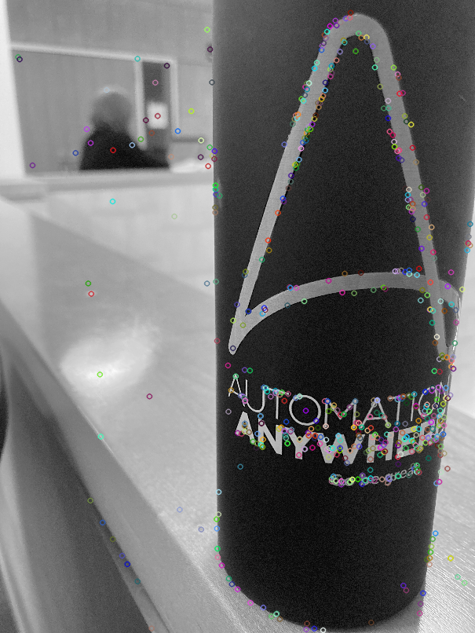
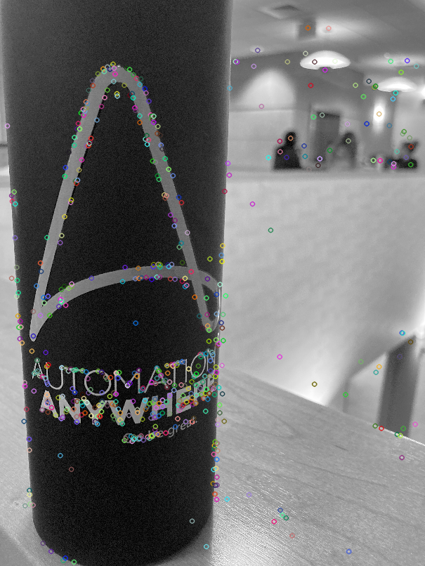
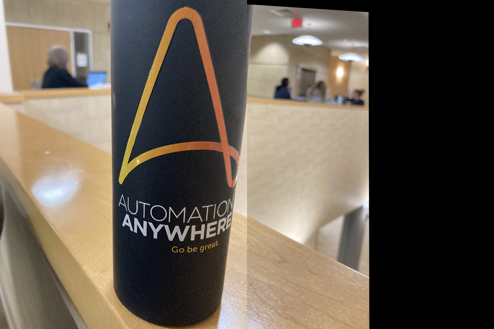

# Panorama Stitching

**Step 1:** Click a wide angle view with 2 images using a digital camera. Eg -


**Step 2**: Find the SIFT-key points and descriptors for both the images. This can be done using the open source `opencv-python` library using `sift.detectAndCompute()` function which computes and returns both keypoints and descriptors for a given input image.
The resulting key points for the 2 images -





**Step 3**: Feature Matching or matching the correspondence key points in the 2 images. 

Algorithm:

```python
# Let desc1 and desc2 be the feature descriptors for keypoints in img1 and img2 respectively 

#list of matches
matches = []
match_threshold = 0.5 # a good values is between 0.5-0.7

for desc in desc1:
	# knn returns the top 2 nearest descriptors to desc in image2 wrt euclidian distance
	best, second_best = knn(desc, desc2, k = 2)
	
	#ratio test
	
	if norm(desc - best) <= match_threshold * norm(desc - second_best):
		match.append((desc, best))
```

Feature matching results for the 2 images -


**Step4**: We use RANSAC (Random SAmple Consensus Iteration) for homography estimation and image stitching by systematically removing the outliers. With the “good sample” of correspondence solve for the closest Homography matrix to be able to project one of the images into the plane of the other image (warpPerspective) and hence obtain a resulting stitched image. Resulting stitched image/ panorama -


